# Synthesis Project -- AI-Assisted Hardware Design Analysis

> **An AI-assisted synthesis & hardware-security workflow prototype -- exploring how graph algorithms and LLM-style assistance can augment conventional EDA flows.**
>
> An open-source, local-first research prototype. Research-prototype quality, not production EDA.

[](https://github.com/MaxTern-cyber/Synthesis_project/actions/workflows/ci.yml)
[](https://synthesisproject-5ax4oq8wquyjmdgp6z9rvy.streamlit.app/)
[](https://www.python.org/downloads/)
[](http://mypy-lang.org/)
[](https://streamlit.io)
[](LICENSE)
[](#)
[](#)
[](#)

> **Try it live:** [synthesisproject-5ax4oq8wquyjmdgp6z9rvy.streamlit.app](https://synthesisproject-5ax4oq8wquyjmdgp6z9rvy.streamlit.app/)
> -- pick a sample design (try `array_mult16.v` for the 1278-node visualization) or upload your own Verilog. Source: [streamlit_app.py](streamlit_app.py).

---

## Why this matters

Modern synthesis, verification, and physical-design flows are predominantly **script-heavy** and **commercial-tool-locked**. Engineers spend significant time on tasks that are fundamentally **graph problems** on the netlist -- fanout exploration, cone tracing, combinational-loop detection, critical-path identification, FSM discovery -- yet day-to-day debugging is gated by proprietary GUIs and TCL.

This project is a **research prototype** asking two questions:

1. **Can a local-first, open-source graph toolkit replicate the analytical core of commercial netlist analyzers** using only NetworkX, PyVis, and Streamlit?
2. **Where can AI-assistance plug into this flow** -- explaining critical paths, summarizing fanout cones, suggesting buffer insertions, flagging hardware-security anti-patterns (unprotected reset chains, suspicious clock-gating)?

The repo answers #1 today (parser + graph algorithms + STA-lite + interactive viz) and is a scaffold for #2 ([`tools/demo2/ai_agent.py`](tools/demo2/ai_agent.py), [`tools/demo4/ai_agent.py`](tools/demo4/ai_agent.py)).

> Framing: this is positioned as **an exploration into AI-assisted semiconductor design workflows**, not a hackathon demo. It is research-prototype quality -- not production EDA -- and the [limitations](#limitations--honest-disclaimers) section is explicit about that.

---

## Status

> Sample designs live in [`samples/`](samples/) -- five small textbook designs (adder, decoder, mux, traffic-light FSM, 3-stage pipeline) plus two **scale-demo** multipliers ([`array_mult8.v`](samples/array_mult8.v), [`array_mult16.v`](samples/array_mult16.v) -- the 16x16 builds to **1278 nodes / 1985 edges**). All are original public-domain designs written for this project -- zero third-party IP. Pre-generated interactive DAG visualizations live in [`outputs/`](outputs/). **Bring your own Verilog** too: any structural / gate-level `.v` works.
>
> Adding ISCAS-85 / OpenCores designs as additional samples is on the [roadmap](#roadmap).

---

## Screenshots & demo

**Scale demo -- full 16x16 array multiplier visualized as a DAG (1278 nodes / 1985 edges):**


| Close-up of gate-level nodes | Sequential / pipeline register graph |
|------------------------------|--------------------------------------|
|  |  |
| Color-coded nodes: `AND` gates (blue), `full_adder` instances (orange), signals (grey). Edges are net connections. | Diamond-shaped nodes are sequential elements (registers). Clock/reset trees fan out from `rst_n`. |

**Demo** -- 6-second walk-through of the analyzer ([download MP4](docs/media/demo.mp4)):


> *All visualizations are produced by [`launchers/generate_sample_outputs.py`](launchers/generate_sample_outputs.py) and live in [`outputs/`](outputs/). Open any `.html` file in a browser for full pan / zoom / hover.*

---

## Architecture

```mermaid
flowchart LR
 subgraph IN[Inputs]
 V[Verilog RTL / Gate-level netlist]
 X[Sample XML / IR]
 end

 subgraph PARSE[Parsing Layer]
 P1[Regex-based Verilog parser]
 P2[Instance & net extractor]
 P3[Library-cell classifier]
 end

 subgraph GRAPH[Graph Model - NetworkX DiGraph]
 G1[Nodes: gates / regs / IO]
 G2[Edges: driver -> sink nets]
 G3[Attrs: cell type, fanout, clock domain]
 end

 subgraph ALGO[Analysis Algorithms]
 A1[Fanout cone - reverse BFS]
 A2[Critical path - longest path on DAG]
 A3[Combinational loops - Tarjan SCC]
 A4[Clock-domain propagation - DFS]
 A5[FSM detection - register graph patterns]
 A6[I/O dependency chains - topological sort]
 end

 subgraph AI[AI-Assistance Layer - prototype]
 AI1[Cone summarization]
 AI2[Anomaly detection - security patterns]
 AI3[Buffer-insertion suggestions]
 end

 subgraph UI[Visualization & UI - Streamlit + PyVis + Plotly]
 U1[Interactive 2D / 3D DAG]
 U2[Per-signal drill-down]
 U3[Critical-path heatmap]
 U4[Reports - HTML / JSON]
 end

 IN --> PARSE --> GRAPH --> ALGO --> UI
 GRAPH --> AI --> UI
```



The flow is intentionally **graph-native end-to-end** -- every analysis is a query against the same `networkx.DiGraph`, which is the most general representation of a netlist after elaboration. This mirrors how modern EDA research (e.g., GNN-based timing prediction, NVIDIA's recent work on graph learning for circuits) increasingly treats post-synthesis netlists as first-class graph objects rather than HDL text.

---

## Algorithms -- Technical Depth

This is the engineering core. Each tool reuses the same `networkx.DiGraph` and composes the algorithms below.

### 1. Fanout-cone extraction -- reverse BFS

For a driver node $d$, the fanout cone is

$$\mathrm{Cone}(d) = \{ v \mid d \rightsquigarrow v \text{ in } G \}$$

Implemented as a **bounded-depth reverse BFS** (`networkx.descendants_at_distance`) so visualization stays interactive even on 10k+ gate designs. Depth-limit is a UI knob -- engineers usually care about levels 1-4.

### 2. Critical path -- longest path on DAG

Once combinational loops are broken at sequential boundaries, the timing graph is a DAG. The longest path is computed in $O(|V|+|E|)$ via topological-sort + DP -- no exponential search needed. Edge weights are unit (gate-count) by default; a kind-keyed delay model lives in [`tools/sta_lite`](tools/sta_lite) -- see below.

### 2b. STA-lite -- arrival / required / slack DP

[`tools/sta_lite`](tools/sta_lite) extends longest-path into a textbook static-timing analyzer:

- Tags each driver node with a `delay` keyed by gate kind (NAND=0.10ns, AND=0.12ns, OR=0.15ns, XOR=0.20ns, NOT=0.05ns, submodule=0.30ns, register=boundary).
- **Forward DP** over topological order -> `arrival[v] = max(arrival[u] + delay(u))`.
- **Backward DP** from primary outputs / register inputs -> `required[u] = min(required[v] - delay(u))` against a target clock period.
- **Slack = required - arrival**. Negative slack -> timing violation.
- Critical-path backtrace + top-N slowest endpoints report.

Wired into the [live Streamlit demo](https://synthesisproject-5ax4oq8wquyjmdgp6z9rvy.streamlit.app/) -- pick a sample, drag the clock-period slider, watch slack flip.

### 2c. Parallelism profile -- DAG levelization & Brent's-bound speedup (GL0AM-inspired)

[`tools/parallelism`](tools/parallelism) answers a different question on the same DAG: **"if you ran this netlist on a parallel logic simulator, how much speedup could you possibly get?"**

The approach is inspired by [NVIDIA Research's GL0AM](https://github.com/NVlabs/GL0AM) (GPU-Accelerated Gate-Level Logic Simulator, Zhang & Ren). GL0AM levelizes the netlist, schedules same-level gates onto GPU SMs in lock-step, and uses graph partitioning to minimize synchronization overhead. This module ports the *analysis* half of that idea to CPU Python:

1. **Levelize the combinational DAG** -- `level[v] = 1 + max(level[u] for u in preds)`. All gates at the same level have no data dependency -> simulable in one parallel step.
2. **Width-per-level histogram** -- wide-and-shallow shape => lots of parallelism; tall-and-narrow => serial-bound.
3. **Brent's bound** -- $\text{speedup}_{\max} = |V|\;/\;L_{\max}$. Upper bound on parallel speedup for *any* parallel simulator on this design.
4. **Partition count** -- weakly-connected components in the register-cut graph. Each partition is an independent combinational cone; more partitions => easier GPU load-balancing.
5. **Verdict** -- coarse "is this design worth GPU-accelerating?" tag (trivial / serial-bound / moderate / GL0AM-regime).

Measured on this repo's samples: `c17` is trivial (2.4x), `c432` is moderate (9.2x, 36 gates per parallel step), and **`array_mult16` lands in the GL0AM-regime at 14.0x with 260 gates per parallel step at its widest level** -- exactly the size class where GPU acceleration starts paying off.

This is a **research-prototype** module; it identifies where GPU acceleration would be valuable, it does not perform GPU simulation itself.

### 2d. Hardware-security audit -- 5 heuristic rules over the DAG

[`tools/security`](tools/security) is a static-analysis pass that surfaces five well-known hardware-security and design-integrity anti-patterns. All rules run in linear time over the same DAG that powers the rest of the suite -- no separate IR, no separate parse.

| Rule | What it catches | Severity | Algorithm |
|---|---|---|---|
| `COMB_LOOP` | Non-trivial SCC in the combinational sub-graph -- a ring oscillator / latch loop | HIGH | Tarjan SCC |
| `RESET_GATING` | A `reset`/`rst` net reaches a register only *after* a combinational gate (data-dependent reset = fault-injection surface) | HIGH | Shortest-path reset->reg, count comb hops |
| `ASYNC_RESET_NO_SYNC` | A reset input drives a register directly with no 2-FF synchronizer chain (metastability / glitch attack surface) | MEDIUM | Successor-register check on the target reg |
| `DANGLING_LOGIC` | Combinational nodes with no forward path to any primary output or register (classic trojan hiding place) | LOW / MEDIUM | Ancestor-set complement; cone-size threshold |
| `MULTI_DRIVER` | Net with > 1 driver (X-prop / glitch / contention) | HIGH | In-degree check on net nodes |

Findings are sorted HIGH -> LOW with a concrete `suggestion:` field on each one. The ruleset is **heuristic** -- false positives are expected; the value is in surfacing candidates for human review, not in formal proof. Reset detection uses a conservative name pattern (`reset|rst|reset_n|rstn`); for production use you would replace this with a proper port-attribute lookup.

Wired into the [live demo](https://synthesisproject-5ax4oq8wquyjmdgp6z9rvy.streamlit.app/) as Section 6 with severity-coloured metrics and a sortable findings table.

### 3. Combinational-loop detection -- Tarjan's SCC

A combinational loop is a strongly connected component of size > 1 in the combinational sub-graph. Tarjan's algorithm finds all SCCs in $O(|V|+|E|)$. Each non-trivial SCC is reported with severity (CRITICAL / WARNING / INFO) based on cycle length and gate composition, with a suggestion of where to insert a register to break it.

### 4. Clock-domain propagation -- DFS with attribute tagging

Clock signals are seed-detected by regex (`clk`, `clock`, `_ck`, ...). A DFS from each clock source propagates the domain attribute through combinational nodes, halting at registers and IOs. This yields the **CDC (clock-domain-crossing) candidate set** for free -- any combinational node visited by two different domains is a CDC candidate.

### 5. FSM / pipeline detection -- register sub-graph patterns

The sub-graph induced by registers + their immediate combinational predecessors is matched against canonical FSM / pipeline templates (small strongly-connected register cliques -> FSM; long register chains -> pipeline). This is heuristic, not formal -- but it is fast and surfaces structural intent.

### 6. I/O dependency chains -- topological sort + path enumeration

For each primary input, a topological forward traversal yields all primary outputs influenced by it. The transitive-closure view exposes **dead inputs**, **dead outputs**, and **maximum logic depth per output** -- useful for both verification coverage and SoC-level timing budgeting. Detailed in [`docs/IO_CHAINS_FEATURE.md`](docs/IO_CHAINS_FEATURE.md).

### 7. AI-assistance hooks (prototype)

`tools/demo2/ai_agent.py` and `tools/demo4/ai_agent.py` provide an entry-point for LLM-driven assistance over the graph:

- **Cone summarization** -- natural-language explanation of "why is signal X high?" given the local fanin sub-graph.
- **Anomaly detection** -- pattern matching for hardware-security smells (unprotected resets, gated clocks without enable balancing, scan chains leaking into functional paths).
- **Buffer-insertion suggestions** -- heuristics over fanout x estimated load.

These are stubs today; the data model is what makes them tractable.

---

## Benchmarks

End-to-end results on the bundled sample designs (single-thread, Python 3.12, no caching). Parse + graph build + full STA-lite sweep, on commodity laptop hardware:

| Sample | Source | Gates | Nodes | Edges | Critical path | Worst slack @ 1ns |
|---|---|---:|---:|---:|---:|---:|
| `c17.v` | ISCAS-85 | 6 | 17 | 18 | 7 | **+0.700 ns** (MET) |
| `decoder2to4.v` | textbook | 6 | 15 | 20 | 5 | +0.830 ns (MET) |
| `mux4to1.v` | textbook | 7 | 20 | 25 | 7 | +0.680 ns (MET) |
| `adder4.v` | textbook | 5 | 34 | 37 | 9 | **-0.200 ns** (4-bit ripple-carry) |
| `pipeline3.v` | textbook | 0+6 reg | 12 | 20 | 1 | +1.000 ns (MET) |
| `fsm_traffic.v` | textbook | 0+2 reg | 9 | 10 | 1 | +1.000 ns (MET) |
| `c432.v` | **ISCAS-85** | 160 | 378 | 518 | 41 | **-1.210 ns** at `N421` |
| `array_mult8.v` | generated | 320 | 326 | 489 | 43 | **-5.120 ns** at `s_7_7` |
| `array_mult16.v` | generated | 1450 | **1278** | **1985** | 91 | **-12.320 ns** at `s_15_15` |
| **Total CI runtime** | | | | | | **< 5 s** for full test suite (36 tests) |

### Parallelism profile (GL0AM-inspired)

Same DAG, different question -- "what's the upper bound on parallel-simulation speedup?"

| Sample | Nodes | Critical path | Max parallel width | **Theoretical speedup** | Verdict |
|---|---:|---:|---:|---:|---|
| `c17.v` | 17 | 7 | 5 | 2.43x | trivial - parallelism moot |
| `decoder2to4.v` | 15 | 5 | 3 | 3.00x | trivial |
| `mux4to1.v` | 20 | 7 | 6 | 2.86x | trivial |
| `adder4.v` | 34 | 9 | 12 | 3.78x | trivial |
| `c432.v` (ISCAS-85) | 378 | 41 | 36 | **9.22x** | moderate - some speedup possible |
| `array_mult8.v` | 326 | 43 | 68 | 7.58x | moderate |
| `array_mult16.v` | **1278** | 91 | **260** | **14.04x** | **excellent - good GPU candidate (GL0AM regime)** |

The headline: as netlists scale, **available parallelism grows faster than the critical path** -- exactly the economic case for GPU-accelerated logic simulation. The `array_mult16` design exposes **260 gates evaluable in one parallel step** at its widest level, which is comfortably in the regime where GL0AM-style scheduling pays off.

Worst-slack numbers use the illustrative delay model in [`tools/sta_lite/`](tools/sta_lite/sta.py); they are not silicon-accurate but they are reproducible and they correctly track design complexity (16x16 multiplier critical path is **91 gates deep** vs. adder's 9).

Reproduce locally:

```powershell
pip install -e ".[dev]"
synthesis-generate-outputs    # regenerates outputs/*.html
pytest -v                      # 24 tests, < 5s
```

---

## Tooling

Seven tools, all built on the same graph core:

| # | Tool | Folder | Purpose |
|---|------|--------|---------|
| 1 | **Hardware Debug Assistant** | [`tools/demo3`](tools/demo3) | Signal tracing, fanout analysis, buffer planning |
| 2 | **Netlist Analyzer** | [`tools/demo2`](tools/demo2) | Interactive DAG + critical-path analysis + AI hooks |
| 3 | **RTL Analyzer** | [`tools/rtl_analyzer`](tools/rtl_analyzer) | Behavioral RTL analysis, FSM / pipeline detection |
| 4 | **Advanced Debugger** | [`tools/final_debugger`](tools/final_debugger) | Comprehensive debugger combining all algorithms |
| 5 | **DAG Visualizer** | [`tools/dag_visualizer`](tools/dag_visualizer) | Standalone interactive DAG generator |
| 6 | **Verilog DAG Tool** | [`tools/demo4`](tools/demo4) | Enhanced netlist analyzer variant |
| 7 | **Early prototype** | [`tools/demo1`](tools/demo1) | Original Verilog DAG / cone-tracing prototype |

---

## Repository Layout

```
.
|-- README.md # you are here
|-- LICENSE # MIT
|-- requirements.txt # Python dependencies for all tools
|-- .gitignore
|
|-- tools/ # all analyzer apps (Streamlit / Python)
| |-- demo1/ # early Verilog DAG prototype
| |-- demo2/ # Netlist Analyzer (port 8620)
| |-- demo3/ # Hardware Debug Assistant (port 8610)
| |-- demo4/ # Netlist Analyzer variant (port 8550)
| |-- rtl_analyzer/ # RTL Analyzer (port 8630)
| |-- final_debugger/ # Advanced Debugger (port 8640)
| \-- dag_visualizer/ # Standalone 3D DAG gen (port 8650)
|
|-- launchers/ # convenience scripts
|-- samples/ # textbook Verilog designs (see samples/README.md)
|-- outputs/ # pre-generated interactive DAG visualizations
|-- docs/ # extended documentation
\-- lib/ # PyVis static assets used by visualizations
```

---

## Quick Start

```powershell
# Clone
git clone https://github.com/MaxTern-cyber/Synthesis_project.git
cd Synthesis_project

# Set up environment
python -m venv .venv
.\.venv\Scripts\Activate.ps1
pip install -r requirements.txt

# Launch interactive menu
python launchers/PRESENTATION_LAUNCHER.py
```

### Install as a package (editable)

Prefer a proper Python package over loose scripts? The project ships a
PEP-621 [`pyproject.toml`](pyproject.toml), so you can install it in
editable mode and get console entry points on your `PATH`:

```powershell
pip install -e .                 # core install
pip install -e ".[dev,viz,export]"  # everything (tests, plots, Excel export)

# Installed console scripts:
synthesis-generate-outputs       # rebuild outputs/ for every sample
synthesis-generate-mult 24       # generate samples/array_mult24.v
synthesis-fix-unicode            # normalize stray unicode to ASCII
```

### Launch a single tool

| Tool | Command | URL |
|------|---------|-----|
| Hardware Debug Assistant | `streamlit run tools/demo3/debug_assistant.py --server.port 8610` | http://localhost:8610 |
| Netlist Analyzer | `streamlit run tools/demo2/local_analyzer.py --server.port 8620` | http://localhost:8620 |
| RTL Analyzer | `streamlit run tools/rtl_analyzer/rtl_analyzer.py --server.port 8630` | http://localhost:8630 |
| Advanced Debugger | `streamlit run tools/final_debugger/advanced_debugger.py --server.port 8640` | http://localhost:8640 |
| DAG Visualizer | `streamlit run tools/dag_visualizer/dag_visualizer.py --server.port 8650` | http://localhost:8650 |

Sample inputs: seven textbook designs ship in [`samples/`](samples/) -- try `samples/adder4.v` (critical path), `samples/decoder2to4.v` (fanout), `samples/fsm_traffic.v` (FSM detection), or **`samples/array_mult16.v`** (16x16 multiplier, ~1280 graph nodes -- scale demo). Pre-built interactive visualizations for each are in [`outputs/`](outputs/). Any other structural / gate-level Verilog `.v` works too.

### Regenerate sample outputs

```powershell
python launchers/generate_sample_outputs.py
```

### Generate a larger multiplier on demand

```powershell
python samples/generate_array_mult.py 24 # 24x24 -> ~3300 primitives
```

---

## Design Decisions

| Decision | Rationale |
|---|---|
| **NetworkX `DiGraph` as the single source of truth** | Decouples parsing from analysis; every algorithm is a graph query. Trivially swappable for `igraph` / `graph-tool` if performance demands. |
| **Regex parser, not a full SystemVerilog frontend** | Targeted at post-synthesis structural Verilog -- the format most relevant for analysis. Frees the project from an antlr/pyverilog dependency-tree and licensing concerns. |
| **Streamlit + PyVis instead of Qt/Tk** | Browser-based UI is friction-free for engineers, deploys to Streamlit Cloud with one click, and matches how modern EDA dashboards are evolving. |
| **Local-first, no cloud / no API keys** | Designs are IP. Anything that ships RTL or post-synth netlists to a third-party endpoint is a non-starter inside chip companies. AI hooks are designed to plug into **local** model backends. |
| **One folder per "demo" tool** | Each tool is an isolated Streamlit app that can be run/deployed/forked independently. |

---

## Limitations & Honest Disclaimers

This is a research prototype. Calling out what it is **not** is part of taking it seriously.

- **STA-lite uses illustrative delays, not silicon-accurate ones.** [`tools/sta_lite`](tools/sta_lite/) ships a kind-keyed unit-delay model (NAND=0.10ns, AND=0.12ns, ...) sufficient to demonstrate arrival/required/slack propagation. A real flow would consume a `.lib` Liberty file -- which is on the roadmap.
- **No SDC / constraints parsing.** Clock period is a UI slider, not a file input.
- **Parser is structural-Verilog-only.** Generate-blocks, parameterised modules, and full SystemVerilog constructs are out of scope.
- **AI-assistance hooks are scaffolds**, not production agents. They demonstrate where an LLM fits -- model selection (Llama-3, Phi-3, local Ollama) is intentionally pluggable.
- **No DRC / LVS / physical-design checks** -- this is netlist analysis, not signoff.
- **Tested on small-to-medium designs (<= ~10K gates).** Scaling to multi-million-gate designs would require swapping NetworkX for a C++ graph backend (`igraph`, `graph-tool`).
- **Not a replacement for commercial tooling** (Conformal, PrimeTime, Genus, DC). The point is to demonstrate that the *analytical core* is reproducible with open primitives, not to compete on signoff quality.

---

## Roadmap

**Shipped:**

- [x] **CI** -- pytest suite (24 tests) + GitHub Actions + mypy type-checking on every push
- [x] **Streamlit Cloud deployment** -- [public live demo](https://synthesisproject-5ax4oq8wquyjmdgp6z9rvy.streamlit.app/)
- [x] **Delay-aware STA-lite** -- arrival / required / slack DP with kind-keyed delays ([`tools/sta_lite/`](tools/sta_lite/))
- [x] **ISCAS-85 benchmarks** -- `c17`, `c432` (160 gates) as canonical academic samples
- [x] **PEP-621 packaging** -- `pip install -e .` with console entry points

**Open ([see issues](https://github.com/MaxTern-cyber/Synthesis_project/issues)):**

- [ ] **Local-LLM agent** ([#3](https://github.com/MaxTern-cyber/Synthesis_project/issues/3)) -- Ollama-backed cone summarization (`Llama-3.2-3B-instruct`, `Phi-3-mini`)
- [ ] **GNN inference experiment** ([#4](https://github.com/MaxTern-cyber/Synthesis_project/issues/4)) -- predict critical-path location from structural features
- [ ] **Hardware-security ruleset** -- codified anti-patterns for clock-gating, reset trees, scan-chain isolation
- [ ] **GraphML / DEF export** -- interoperate with OpenROAD / Yosys / open-source PD flows
- [ ] **Larger ISCAS-85 designs** (`c1908`, `c6288` -- 2400 gates)

**Future research directions** (open to collaboration):

- LLM-assisted RTL debugging (explain a failing path in natural language)
- Equivalence-aware optimization hints
- Formal-verification integration (Conformal-style LEC pre-checks)
- Intelligent synthesis-recommendation systems (predict good `compile_ultra` settings from netlist features)
- AI-guided timing/power tradeoff exploration

Contributions and ideas welcome -- see [CONTRIBUTING.md](CONTRIBUTING.md).

---

## Documentation

| Doc | Description |
|-----|-------------|
| [docs/DOCUMENTATION.md](docs/DOCUMENTATION.md) | Architecture, algorithms, internal API |
| [docs/USAGE_GUIDE.md](docs/USAGE_GUIDE.md) | Step-by-step usage examples |
| [docs/QUICK_START.md](docs/QUICK_START.md) | Fastest path to a running demo |
| [docs/IO_CHAINS_FEATURE.md](docs/IO_CHAINS_FEATURE.md) | I/O dependency-chain feature |
| [docs/ENHANCEMENTS_SUMMARY.md](docs/ENHANCEMENTS_SUMMARY.md) | Feature additions |
| [docs/LINKEDIN_POST.md](docs/LINKEDIN_POST.md) | Draft LinkedIn announcement |
| [docs/BLOG_POST.md](docs/BLOG_POST.md) | Long-form technical write-up |
| [CREDITS.md](CREDITS.md) | Sample-file provenance, third-party libraries, and academic references |

---

## Credits & references

All sample designs are original public-domain textbook circuits written
for this project. All third-party libraries are open source under
permissive licenses (BSD / MIT / Apache-2.0). See [CREDITS.md](CREDITS.md)
for the full attribution table, library license list, and academic
references underlying each algorithm.

---

## Author

**Mallikarjuna A L** -- EDA engineer building open-source tools for hardware verification.

- GitHub: [@MaxTern-cyber](https://github.com/MaxTern-cyber)
- LinkedIn: [mallikarjuna-a-l](https://www.linkedin.com/in/mallikarjuna-a-l)
- Email: mallikarjunaal.ec21@gmail.com

If you work in EDA, formal verification, synthesis, hardware security, or AI-for-chip-design -- I'd love to talk.

---

## License

[MIT](LICENSE) -- use freely, attribution appreciated.
